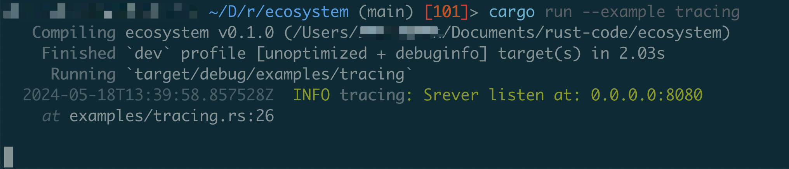
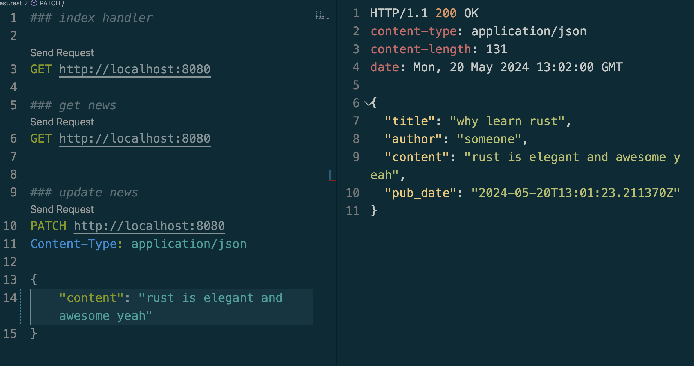

# Rust Ecosystem

## Tracing



## OpenTelemetry

```sh
cargo add opentelemetry-otlp --features tonic

cargo add opentelemetry

cargo add opentelemetry_sdk --features rt-tokio

cargo add tracing-opentelemetry
```

## Macro

```sh
cargo add derive_more
cargo add derive_builder
```

## Serde

```sh
cargo add chrono --features serde
```



## chat server

```sh
cargo add dashmap
cargo add tokio-stream
cargo add tokio-util --features codec
cargo add futures
```