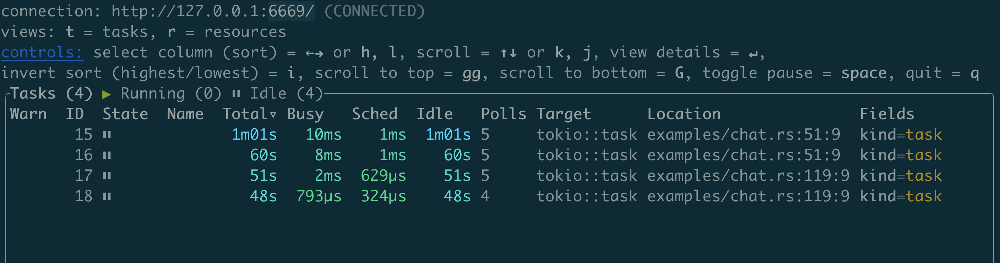

# Rust Ecosystem

## Tracing


## OpenTelemetry

```sh
cargo add opentelemetry-otlp --features tonic

cargo add opentelemetry

cargo add opentelemetry_sdk --features rt-tokio

cargo add tracing-opentelemetry
```

## Macro

```sh
cargo add derive_more
cargo add derive_builder
```

## Serde

```sh
cargo add chrono --features serde
```


## chat server

```sh
cargo add dashmap
cargo add tokio-stream
cargo add tokio-util --features codec
cargo add futures
```

```sh
2024-05-26T01:36:09.984610Z  INFO chat: listen on: 0.0.0.0:8080
2024-05-26T01:36:43.613155Z  INFO chat: client conn from: 127.0.0.1:60079
2024-05-26T01:36:55.352600Z  INFO chat: [forfd8960 joined the chat]
2024-05-26T01:37:18.456555Z  INFO chat: client conn from: 127.0.0.1:60171
2024-05-26T01:37:22.747436Z  INFO chat: [alice joined the chat]
```

### sender1

```sh
telnet localhost 8080
Trying ::1...
telnet: connect to address ::1: Connection refused
Trying 127.0.0.1...
Connected to localhost.
Escape character is '^]'.
Your username:
forfd8960
hello, my friend
[alice joined the chat]
nice to meet u
alice: nice to meet u too
alice: how are u
I'm fine, thank u

user: alice leave the chat left
```

```sh
telnet localhost 8080
Trying ::1...
telnet: connect to address ::1: Connection refused
Trying 127.0.0.1...
Connected to localhost.
Escape character is '^]'.
Your username:
alice
forfd8960: nice to meet u
nice to meet u too
how are u
forfd8960: I'm fine, thank u
```

### tokio-console

